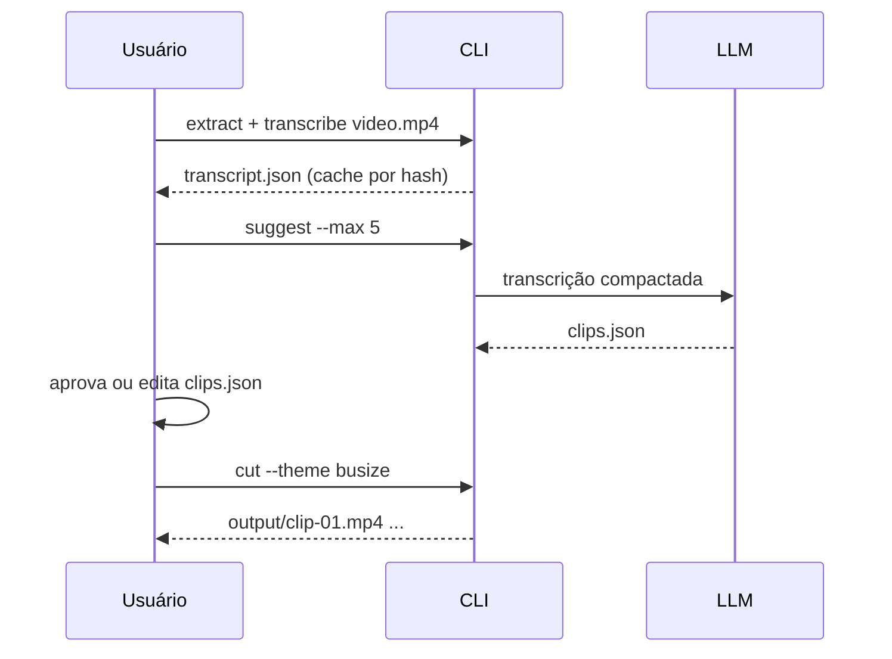
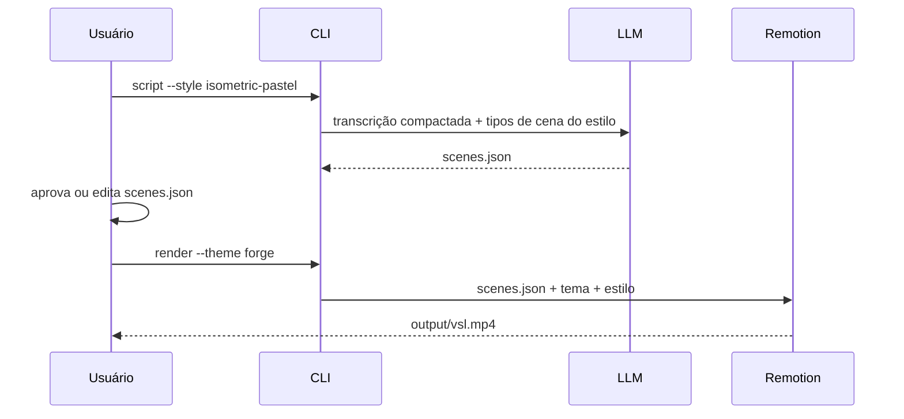

# Fluxos — reel-studio

## Modo corte (vídeo bom)

```mermaid
sequenceDiagram
  participant U as Usuário
  participant C as CLI
  participant L as LLM
  U->>C: extract + transcribe video.mp4
  C-->>U: transcript.json (cache por hash)
  U->>C: suggest --max 5
  C->>L: transcrição compactada
  L-->>C: clips.json
  U->>U: aprova ou edita clips.json
  U->>C: cut --theme busize
  C-->>U: output/clip-01.mp4 ...
```

## Modo VSL (vídeo ou áudio ruim)

```mermaid
sequenceDiagram
  participant U as Usuário
  participant C as CLI
  participant L as LLM
  participant R as Remotion
  U->>C: script --style isometric-pastel
  C->>L: transcrição compactada + tipos de cena do estilo
  L-->>C: scenes.json
  U->>U: aprova ou edita scenes.json
  U->>C: render --theme forge
  C->>R: scenes.json + tema + estilo
  R-->>U: output/vsl.mp4
```
